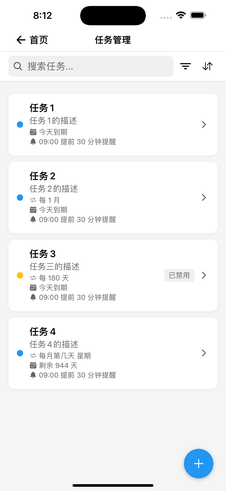
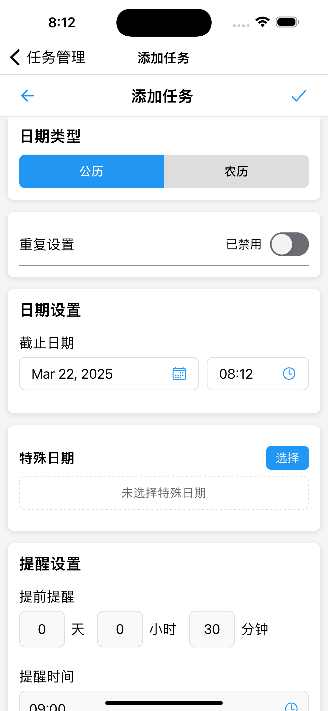
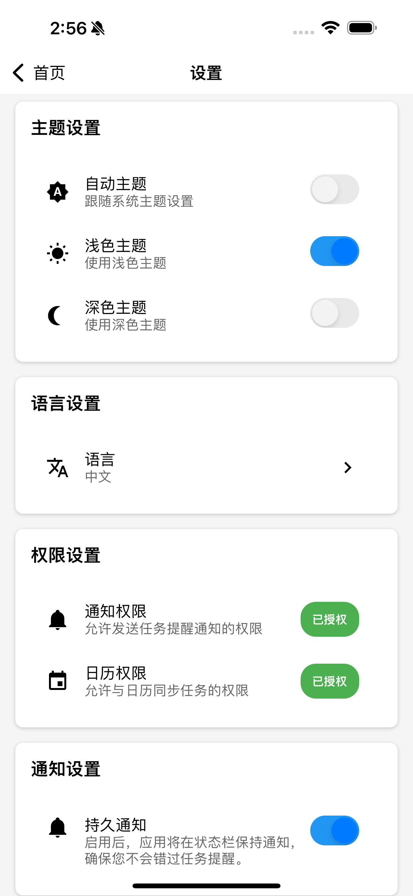

# NeverMiss

<div align="center">

[](https://reactnative.dev/)
[](https://expo.dev/)
[](https://www.typescriptlang.org/)
[](LICENSE)

</div>

<p align="center">
  
</p>

<p align="center">
  永不错过重要任务的智能提醒应用
</p>

## ✨ 功能特点

- 🔄 **灵活的循环任务** - 每日、每周、每月或自定义间隔
- 🔔 **智能提醒系统** - 自定义提醒时间，后台监控
- 🌙 **深色模式支持** - 简洁优雅的用户界面
- 📱 **离线优先架构** - 基于 AsyncStorage 的本地数据存储
- 📅 **农历和公历支持** - 支持农历和公历日期设置
- 🏷️ **标签管理** - 使用标签组织和分类任务

## 📱 截图

<div align="center">
  
  
  
  
</div>

## 🚀 快速开始

### 环境要求

- Node.js (v14+)
- npm (v9+) 或 yarn (v1.22+)
- [Expo CLI](https://docs.expo.dev/get-started/installation/)
- Android Studio (Android开发)
- Xcode (iOS开发，仅macOS)

### 安装步骤

```bash
# 克隆仓库
git clone https://github.com/zfonlyone/NeverMiss.git
cd NeverMiss

# 安装依赖
npm install

# 启动开发服务器
npm start
# 或
expo start

# 使用expo运行
npx expo run:android


# 在模拟器或设备上运行
# Android
npm run android

# iOS
npm run ios


使用eas构建 
# Android APK预览版
npx eas build --platform android --profile preview --local

# Android生产版
npx eas build --platform android --profile production --local

# iOS (仅macOS)
npx eas build --platform ios --profile preview --local
```
详细的安装和开发指南请参考：
- [开发指南](docs/DEVELOPMENT_GUIDE.md)
- [贡献指南](docs/CONTRIBUTING.md)

## 🛠️ 技术栈

- [React Native](https://reactnative.dev/) - 移动应用框架
- [Expo](https://expo.dev/) - 开发平台
- [TypeScript](https://www.typescriptlang.org/) - 类型安全
- [AsyncStorage](https://react-native-async-storage.github.io/async-storage/) - 本地数据存储
- [Expo Router](https://docs.expo.dev/router/introduction/) - 文件路由系统

## 📂 项目结构

```
/
├── app/                # Expo Router应用入口
│   ├── _layout.tsx     # 应用布局定义
│   ├── index.tsx       # 主页面定义
│   └── ...             # 其他路由
├── assets/             # 静态资源（图片、字体等）
├── components/         # 共享UI组件
├── config/             # 应用配置
├── constants/          # 常量定义
├── contexts/           # React Context定义
├── controllers/        # 控制器层（MVC架构）
├── docs/               # 项目文档
├── hooks/              # 自定义React Hooks
├── locales/            # 国际化资源
├── migrations/         # 数据库迁移脚本
├── models/             # 数据模型
├── navigation/         # 导航配置
├── scripts/            # 构建和部署脚本
├── screens/            # 应用屏幕
├── services/           # 服务层
└── utils/              # 工具函数
```

完整的项目结构请参考：
- [项目结构说明](docs/PROJECT_STRUCTURE.md)
- [应用架构说明](docs/ARCHITECTURE.md)

## 🏗️ 项目架构

NeverMiss采用修改版的MVC架构，结合了React Native的组件化特性：

- **模型层 (Models)**: 定义数据结构和类型
- **视图层 (Views)**: 组件和屏幕，负责UI展示
- **控制器层 (Controllers)**: 处理业务逻辑
- **服务层 (Services)**: 与外部系统交互

详细的架构说明请参考：
- [应用架构说明](docs/ARCHITECTURE.md)

## 🔧 常见问题

遇到问题? 查看我们的[常见问题解决方案](docs/DEVELOPMENT_GUIDE.md#8-常见问题解答)。

## 🤝 贡献指南

1. Fork 仓库
2. 创建功能分支 (`git checkout -b feature/amazing-feature`)
3. 提交更改 (`git commit -m 'feat: 添加新功能'`)
4. 推送到分支 (`git push origin feature/amazing-feature`)
5. 打开 Pull Request

详细的贡献指南请参考：
- [贡献指南](docs/CONTRIBUTING.md)

## 📄 许可证

本项目采用 MIT 许可证 - 详情请参阅 [LICENSE](LICENSE) 文件。

## 👏 致谢

- [Expo](https://expo.dev/) - 提供了出色的开发平台
- [React Native](https://reactnative.dev/) - 提供了移动框架
- [AsyncStorage](https://react-native-async-storage.github.io/async-storage/) - 提供了可靠的数据存储解决方案

# NeverMiss 应用构建说明

## 版本类型

本项目使用GitHub Actions实现自动化构建，分为以下几种版本类型：

### 1. 商店正式版本（Store Version）

- **触发方式**：main/master分支手动触发
- **工作流名称**：Build Release (Store Version)
- **构建文件**：`.github/workflows/build-and-release.yml`
- **构建内容**：
  - **Android**: 签名版APK和AAB包，可直接上架Google Play
  - **iOS**: 签名版IPA，可直接上架App Store
- **使用说明**：适用于正式发布到应用商店的版本

### 2. 发布测试版本（Release Test Version）

- **触发方式**：main/master分支带v标签自动触发，或手动触发
- **工作流名称**：Build Release Test Version
- **构建文件**：`.github/workflows/build-test.yml`
- **构建内容**：
  - **Android**: 无签名APK
  - **iOS**: 无签名IPA
- **使用说明**：适用于上架前测试，验证功能是否正常，但无需正式签名

### 3. 开发调试版本（Debug Version）

- **触发方式**：dev及开发相关分支每次提交自动构建，或手动触发
- **工作流名称**：Build Debug Version
- **构建文件**：`.github/workflows/build-debug.yml`
- **构建内容**：
  - **Android**: 调试版APK
  - **iOS**: 模拟器调试包
- **使用说明**：
  - 需要PC运行开发服务器
  - 适用于日常开发调试使用

### 4. Expo云构建版本（Expo Cloud Version）

- **触发方式**：main分支手动触发
- **工作流名称**：Build Expo Cloud Version
- **构建文件**：`.github/workflows/build-release-eas.yml`
- **构建内容**：
  - **Android**: 由Expo云服务构建和签名的APK
  - **iOS**: 由Expo云服务构建，需通过TestFlight分发
- **使用说明**：
  - 使用Expo托管的构建服务
  - Android版可直接安装测试
  - iOS版需通过Expo开发者控制台获取

### 5. Expo开发版本（不需构建）

- **说明**：
  - 不需要构建app
  - 运行开发服务器后，使用官方Expo应用扫码测试页面

## 构建产物说明

### Android版本

- `NeverMiss-Android-Store.apk` - 商店正式签名版APK
- `NeverMiss-Android-Store.aab` - Google Play上传包
- `NeverMiss-Android-ReleaseTest.apk` - 发布测试版APK（无签名）
- `NeverMiss-Android-debug.apk` - 开发调试版APK
- `NeverMiss-Android-ExpoCloud.apk` - Expo云构建版本APK

### iOS版本

- `NeverMiss-iOS-Store.ipa` - App Store上传包（签名版）
- `NeverMiss-iOS-ReleaseTest.ipa` - 发布测试版IPA（无签名）
- `NeverMiss-iOS-Simulator-debug.zip` - 模拟器调试包
- Expo云构建版iOS应用 - 仅在Expo开发者控制台可见

## 使用指南

1. **发布正式版本**：
   - 确认版本号和功能后，在GitHub仓库手动触发`Build Release (Store Version)`工作流
   
2. **发布测试版本**：
   - 在main/master分支打标签`v*.*.*`(如v1.0.0)自动触发构建
   - 或手动触发`Build Release Test Version`工作流
   
3. **日常开发**：
   - 提交代码到dev或开发分支会自动构建开发调试版
   - 需要PC运行开发服务器配合使用

4. **Expo云构建**：
   - 在main分支手动触发`Build Expo Cloud Version`工作流
   - 适用于需要使用Expo托管构建服务的情况

## 注意事项

- 所有构建版本可在GitHub Releases页面查看和下载
- 签名相关密钥和证书请勿上传到仓库
- 正式发布前请确保package.json中的版本号与config/version.ts保持一致
- Expo云构建需要有效的Expo账号和相应的访问令牌
