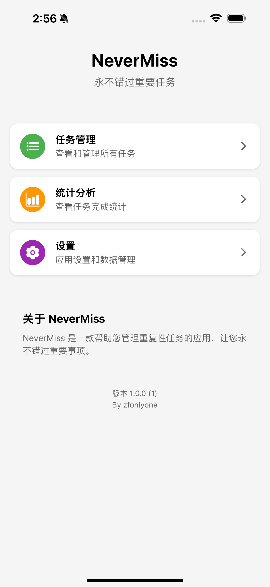

# NeverMiss

<div align="center">

[](https://reactnative.dev/)
[](https://expo.dev/)
[](https://www.typescriptlang.org/)
[](LICENSE)

</div>

<p align="center">
  
</p>

<p align="center">
  永不错过重要任务的智能提醒应用
</p>

## ✨ 功能特点

- 🔄 **灵活的循环任务** - 每日、每周、每月或自定义间隔
- 🔔 **智能提醒系统** - 自定义提醒时间，后台监控
- 🌙 **深色模式支持** - 简洁优雅的用户界面
- 📱 **离线优先架构** - 基于 AsyncStorage 的本地数据存储
- 📅 **农历和公历支持** - 支持农历和公历日期设置
- 🏷️ **标签管理** - 使用标签组织和分类任务

## 📱 截图

<div align="center">
  
  
  
  
</div>

## 🚀 快速开始

### 环境要求

- Node.js (v14+)
- npm (v9+) 或 yarn (v1.22+)
- [Expo CLI](https://docs.expo.dev/get-started/installation/)
- Android Studio (Android开发)
- Xcode (iOS开发，仅macOS)

### 安装步骤

```bash
# 克隆仓库
git clone https://github.com/zfonlyone/NeverMiss.git
cd NeverMiss

# 安装依赖
npm install

# 启动开发服务器
npm start
# 或
expo start

# 使用expo运行
npx expo run:android


# 在模拟器或设备上运行
# Android
npm run android

# iOS
npm run ios


使用eas构建 
# Android APK预览版
npx eas build --platform android --profile preview --local

# Android生产版
npx eas build --platform android --profile production --local

# iOS (仅macOS)
npx eas build --platform ios --profile preview --local
```
详细的安装和开发指南请参考：
- [开发指南](docs/DEVELOPMENT_GUIDE.md)
- [贡献指南](docs/CONTRIBUTING.md)

## 🛠️ 技术栈

- [React Native](https://reactnative.dev/) - 移动应用框架
- [Expo](https://expo.dev/) - 开发平台
- [TypeScript](https://www.typescriptlang.org/) - 类型安全
- [AsyncStorage](https://react-native-async-storage.github.io/async-storage/) - 本地数据存储
- [Expo Router](https://docs.expo.dev/router/introduction/) - 文件路由系统

## 📂 项目结构

```
/
├── app/                # Expo Router应用入口
│   ├── _layout.tsx     # 应用布局定义
│   ├── index.tsx       # 主页面定义
│   └── ...             # 其他路由
├── assets/             # 静态资源（图片、字体等）
├── components/         # 共享UI组件
├── config/             # 应用配置
├── constants/          # 常量定义
├── contexts/           # React Context定义
├── controllers/        # 控制器层（MVC架构）
├── docs/               # 项目文档
├── hooks/              # 自定义React Hooks
├── locales/            # 国际化资源
├── migrations/         # 数据库迁移脚本
├── models/             # 数据模型
├── navigation/         # 导航配置
├── scripts/            # 构建和部署脚本
├── screens/            # 应用屏幕
├── services/           # 服务层
└── utils/              # 工具函数
```

完整的项目结构请参考：
- [项目结构说明](docs/PROJECT_STRUCTURE.md)
- [应用架构说明](docs/ARCHITECTURE.md)

## 🏗️ 项目架构

NeverMiss采用修改版的MVC架构，结合了React Native的组件化特性：

- **模型层 (Models)**: 定义数据结构和类型
- **视图层 (Views)**: 组件和屏幕，负责UI展示
- **控制器层 (Controllers)**: 处理业务逻辑
- **服务层 (Services)**: 与外部系统交互

详细的架构说明请参考：
- [应用架构说明](docs/ARCHITECTURE.md)

## 🔧 常见问题

遇到问题? 查看我们的[常见问题解决方案](docs/DEVELOPMENT_GUIDE.md#8-常见问题解答)。

## 🤝 贡献指南

1. Fork 仓库
2. 创建功能分支 (`git checkout -b feature/amazing-feature`)
3. 提交更改 (`git commit -m 'feat: 添加新功能'`)
4. 推送到分支 (`git push origin feature/amazing-feature`)
5. 打开 Pull Request

详细的贡献指南请参考：
- [贡献指南](docs/CONTRIBUTING.md)

## 📄 许可证

本项目采用 MIT 许可证 - 详情请参阅 [LICENSE](LICENSE) 文件。

## 👏 致谢

- [Expo](https://expo.dev/) - 提供了出色的开发平台
- [React Native](https://reactnative.dev/) - 提供了移动框架
- [AsyncStorage](https://react-native-async-storage.github.io/async-storage/) - 提供了可靠的数据存储解决方案
